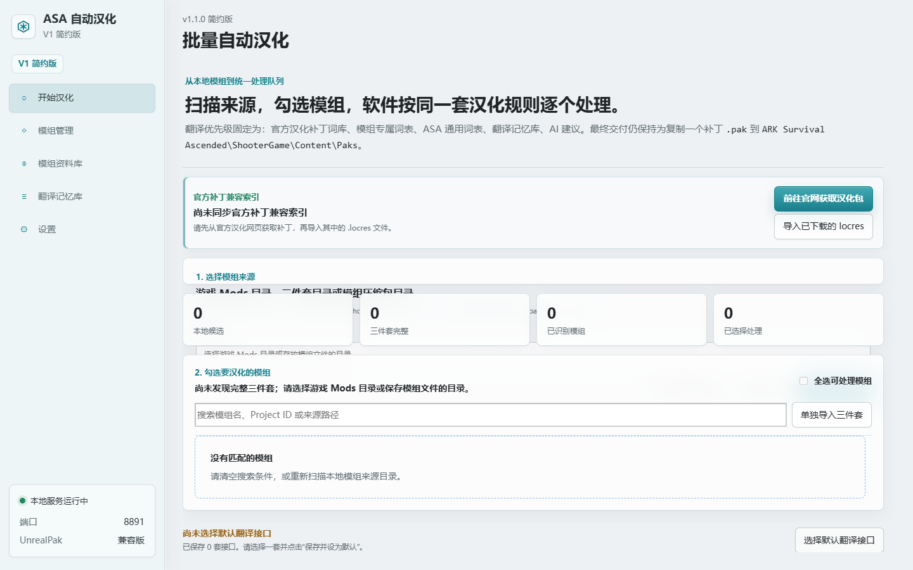
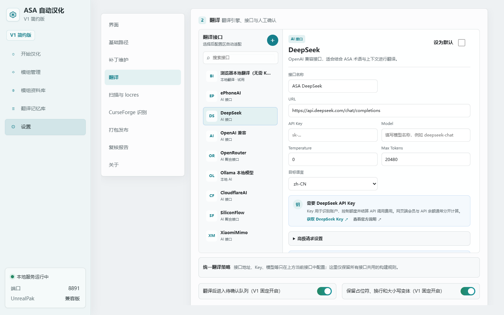
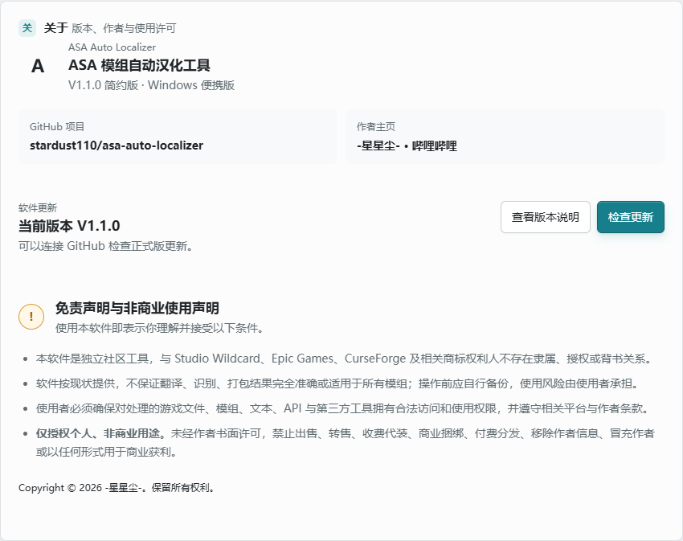

# ASA 模组自动汉化工具

面向 Windows 的《方舟：生存飞升》（ARK: Survival Ascended，简称 ASA）模组本地汉化工具。它把模组扫描、文本识别、术语匹配、AI 翻译、人工复核和补丁构建集中在一个中文界面中，适合希望自行制作与维护汉化补丁的玩家。

[下载最新版](https://github.com/stardust110/asa-auto-localizer/releases/latest) · [查看 V1.1.0 更新说明](https://github.com/stardust110/asa-auto-localizer/releases/tag/v1.1.0) · [作者主页：-星星尘-](https://space.bilibili.com/629899723)

> 当前发布：V1.1.0 简约版，Windows 便携版。无需安装 Python，完整解压后运行 `ASA模组自动汉化工具.exe`。

## 能做什么

### 扫描并识别真实模组资产

- 可选择游戏 `Mods` 目录、本地三件套目录或模组压缩包目录。
- 递归识别 `.pak`、`.ucas`、`.utoc`，检查三件套是否完整。
- 支持自动识别常见 Steam/ASA 游戏目录，也可使用软件内文件夹选择器手动指定。
- 扫描真实资产并区分物品名称、描述、技能、HUD、Widget、枚举等文本类型，不只读取模组名称。

### 多层翻译策略

翻译会按照固定优先级复用可靠结果：

1. 官方汉化补丁词库
2. 模组专属术语表
3. ASA 通用术语表
4. 本地翻译记忆库
5. 当前默认翻译接口生成的建议

软件可保存多套翻译接口，但实际处理时只使用用户明确设为默认的接口；开始处理前会检查并提醒。翻译结果先进入待复核队列，不会把未经确认的建议直接当作最终译文。

### 多种翻译接口

- 浏览器本地翻译（试用，无需 Key，取决于 Chrome/Edge 当前版本与语言模型支持）
- DeepSeek、OpenAI 兼容接口、OpenRouter
- Ollama 本地模型
- Cloudflare AI、SiliconFlow、XiaomiMimo、Aliyun Bailian、Cerebras 等接口模板
- 可配置模型、温度、最大输出长度、源语言、目标语言与高级请求参数
- API Key 仅保存在本机，不写入汉化补丁或公开发行包

### 翻译记忆与人工复核

- 已保存译文会进入本地翻译记忆库，后续扫描可自动复用。
- 保留 source、key、namespace、原文、译文、来源和状态，便于追踪。
- 未确定文本、低置信度结果和不适合自动覆盖的内容会进入待确认队列。
- 支持保留占位符、换行和大小写变体，降低格式被翻译破坏的风险。
- 软件崩溃或关闭后，已落盘的设置、资料、译文和任务记录仍会保留。

### CurseForge 模组资料库

- 使用 Project ID 或本地扫描结果识别 CurseForge 模组。
- 同步模组名称、作者、分类、简介、封面和官方页面信息。
- 可单独翻译模组介绍，并保留原文与中文介绍供核对。
- 资料卡使用固定比例响应式排列，适合同时管理多个模组。

### 构建与补丁维护

- 只把用户勾选模组中已经确认并应用的译文加入构建。
- 生成 `locres` 与可安全处理的资产覆盖层，并进行构建前完整性检查。
- 支持纯中文、物品双语 `中文[English]` 等构建模式。
- 生成的测试包先写入软件测试目录，不会直接覆盖游戏正式目录。
- 补丁维护页可扫描、识别和删除已确认的汉化补丁，避免误删游戏本体文件。
- 最终交付保持为复制补丁文件到 `ARK Survival Ascended\ShooterGame\Content\Paks`。

### 本地数据与更新

- 软件默认仅在 `127.0.0.1` 启动本地服务，界面由浏览器打开。
- 设置、API Key、模组资料、翻译记忆和任务历史保存在软件目录下的 `data` 文件夹。
- 配置和任务状态采用原子写入；异常退出后已保存内容不会自动清空。
- 内置 GitHub Releases 更新检查，下载后进行 SHA256 校验。
- 更新前备份将被替换的程序文件，失败时回滚，并始终跳过用户 `data` 目录。

## 使用流程

1. 从 [Releases](https://github.com/stardust110/asa-auto-localizer/releases/latest) 下载 ZIP 和 `SHA256SUMS.txt`，核对摘要后完整解压。
2. 运行 `ASA模组自动汉化工具.exe`，在“设置”中自动识别或选择模组、输出和兼容工具目录。
3. 配置并测试一个翻译接口，将其保存为默认接口；也可尝试浏览器本地翻译。
4. 回到“开始汉化”，扫描来源、勾选模组、处理译文并完成人工复核。
5. 通过构建前检查后生成测试补丁，备份游戏目录，再复制到 ASA 的 `Content\Paks` 中进游戏验证。

## 运行要求

- Windows 10/11 64 位
- 可写的软件解压目录
- 待处理模组的合法本地文件
- 处理 IoStore 资产时需要用户自行准备兼容的 `retoc` 工具
- 构建 PAK 时需要用户电脑上依法安装的兼容 `UnrealPak` 完整工具目录
- 使用在线 AI 或 CurseForge 元数据时需要网络及相应服务凭据

公开发行包不附带 UnrealPak、retoc、游戏资产、API Key、用户配置或历史数据。请勿只复制单个 EXE；程序运行还依赖同目录中的发行文件和后续生成的 `data` 目录。

## 数据与隐私

- 只有用户主动配置并调用在线翻译或元数据服务时，相关请求才会发送给对应服务商。
- API Key 不写入日志、补丁、截图或导出的公开软件包。
- 软件升级时保留原安装目录的 `data` 文件夹，即可继续使用原有设置和翻译历史。
- 建议定期备份 `data` 以及已经验证可用的汉化补丁。

## 重要限制

- 自动扫描与打包通过不代表游戏内显示一定正确，最终仍需进入游戏验证。
- Widget、Blueprint、HUD、轮盘菜单及运行时动态文本可能需要额外资产覆盖或人工处理。
- 浏览器本地翻译依赖浏览器版本、设备和语言模型可用性，不保证所有 Chrome/Edge 环境都支持。
- 本项目不是 Studio Wildcard、Epic Games 或 CurseForge 的官方产品，也未获得其背书。

## 许可与免责声明

本软件仅授权个人、非商业用途。禁止出售、转售、收费代装、商业捆绑、付费分发、移除作者信息、冒充作者或未经许可复制后作为其他产品发布。

软件按现状提供，不保证翻译、识别或打包结果适用于所有模组。操作前请备份，并确保对所处理的游戏文件、模组、文本、API 和第三方工具拥有合法访问和使用权限。使用风险由使用者自行承担。

作者：[-星星尘-](https://space.bilibili.com/629899723)

完整条款见发行包内的 `LICENSE-NONCOMMERCIAL.md`。
